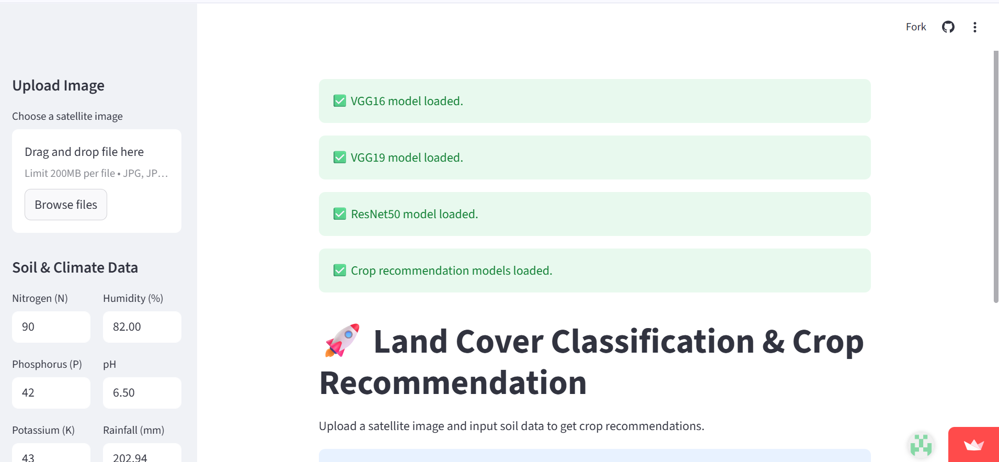

# 🌍 Land Classification & Crop Recommendation System

An AI-powered decision support system that classifies land from satellite images and recommends the best crops for agricultural land using machine learning.

# 🚀 Overview

This project integrates Deep Learning (CNN-based Land Classification) and Machine Learning (Crop Recommendation) to build a smart, unified system that helps farmers, planners, and researchers make informed decisions.

Users can upload a land image → the model classifies the land type → if land is agricultural, a crop recommendation model suggests the best crops based on environmental conditions.

# ✨ Features
# 🔵 Land Classification (CNN – EuroSAT Dataset)

Trained using VGG16, VGG19, and ResNet50

Classifies land into 10 classes:

Agricultural

Residential

Forest

River

Industrial

Herbaceous Vegetation

and more...

Achieves high accuracy on EuroSAT RGB dataset

# 🟢 Crop Recommendation (ML Model – Kaggle Dataset)

Recommends crops based on:

Nitrogen (N)

Phosphorus (P)

Potassium (K)

Temperature

Humidity

Soil pH

Rainfall

Suggested crops include:

Rice, Wheat, Maize, Barley

Cotton, Sugarcane, Tea

Pulses & Oilseeds

# 🟣 Integrated Pipeline

User uploads land image

CNN model predicts land type

If land = agricultural, the crop model predicts best crops

Streamlit UI displays results in a clean and interactive way

# 🏗️ System Architecture
                ┌────────────────┐
                │  User Uploads  │
                │  Land Image    │
                └───────▲────────┘
                        │
                        │
                ┌───────┴────────┐
                │ Land Classifier │  → (VGG16/VGG19/ResNet50)
                └───────▲────────┘
                        │
                        │ If Agricultural Land
                ┌───────┴────────┐
                │ Crop Recommender│ → ML Model
                └───────▲────────┘
                        │
                ┌───────┴────────┐
                │ Streamlit Output│
                └────────────────┘

# 🧠 Model Details
1️⃣ Land Classification (CNN)

Pretrained models finetuned:

VGG16

VGG19

ResNet50

Loss: categorical_crossentropy

Optimizer: Adam

Dataset: EuroSAT (RGB 10-class)

2️⃣ Crop Recommendation (ML)

Models tested:

Random Forest

SVM

Decision Tree

Logistic Regression

Final chosen model based on accuracy & stability:
⭐ Random Forest Classifier

# 🛠️ Tech Stack
Backend / ML

Python

TensorFlow / Keras

Scikit-learn

NumPy, Pandas

Frontend / UI

Streamlit

Visualization

Matplotlib

Seaborn

# 📦 Installation & Running the Project
# Clone the repository
git clone https:https://github.com/bhavika6631/streamlit_app/tree/main

# Navigate to project folder
cd land-classification-crop-recommendation

# Install required libraries
pip install -r requirements.txt

# Run Streamlit App
streamlit run app.py

# 📸 Demo (Screenshots)

 Upload your images inside a folder named images/ and reference them like:

# 📊 Results
Land Classification
Model	Accuracy
VGG16	~92.12%
VGG19	~91%
ResNet50	~94.5%
Crop Recommendation
Model	Accuracy
Random Forest	~99.7%
Decision Tree	~99%
SVM	~99.12%
# 🔮 Future Enhancements

Add NDVI/Remote Sensing indices for deeper land analysis

Deploy model on cloud (AWS/GCP/Streamlit Cloud)

Add rainfall forecasting for seasonal crop suggestions

Mobile app version using React Native / Flutter

# 📝 Research Paper 

This project is also structured for a research paper including:

Dataset preprocessing

CNN model comparison

ML model performance

Integrated decision pipeline
 # Streamlit app link :
 https://appapp-fje9owrhmhtu3q7qw7k6j2.streamlit.app/

# 👩‍💻 Author

Bhavika Reddy Alsani(Team lead)
AI & ML Engineer
GitHub:(https://github.com/bhavikaalsani)

C.Sneha
AI & ML Enginner

Bojja Lavanya
Ai & Ml Enginner

